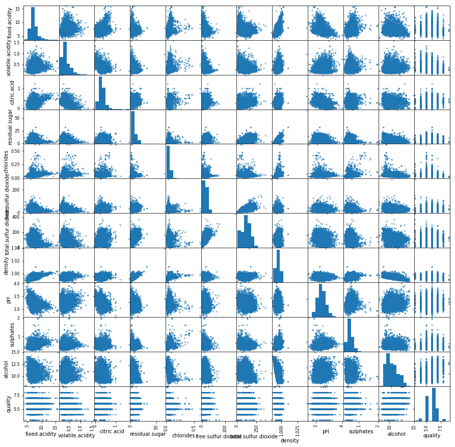
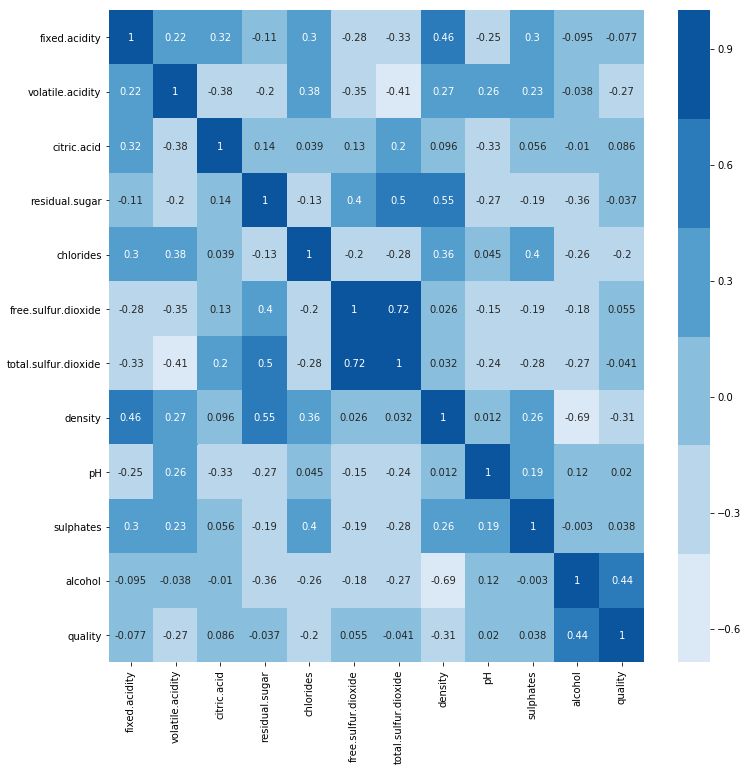
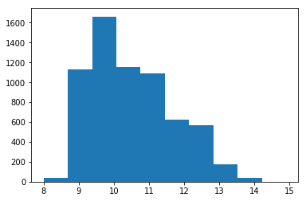
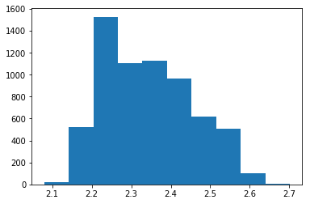

### Questions


### Objectives
YWBAT
* apply data cleaning techniques to condition data for modeling
* analyze a MLR to drive changes and improve modeling

### Outline


```python
import numpy as np
import pandas as pd

import statsmodels.api as sm
import statsmodels.stats as sts
import scipy.stats as stats

import matplotlib.pyplot as plt
import seaborn as sns
```


```python
df = pd.read_csv("dataset.csv")
df.head()
```


<div>
<style scoped>
    .dataframe tbody tr th:only-of-type {
        vertical-align: middle;
    }

    .dataframe tbody tr th {
        vertical-align: top;
    }

    .dataframe thead th {
        text-align: right;
    }
</style>
<table border="1" class="dataframe">
  <thead>
    <tr style="text-align: right;">
      <th></th>
      <th>fixed.acidity</th>
      <th>volatile.acidity</th>
      <th>citric.acid</th>
      <th>residual.sugar</th>
      <th>chlorides</th>
      <th>free.sulfur.dioxide</th>
      <th>total.sulfur.dioxide</th>
      <th>density</th>
      <th>pH</th>
      <th>sulphates</th>
      <th>alcohol</th>
      <th>quality</th>
    </tr>
  </thead>
  <tbody>
    <tr>
      <th>0</th>
      <td>7.4</td>
      <td>0.70</td>
      <td>0.00</td>
      <td>1.9</td>
      <td>0.076</td>
      <td>11.0</td>
      <td>34.0</td>
      <td>0.9978</td>
      <td>3.51</td>
      <td>0.56</td>
      <td>9.4</td>
      <td>5</td>
    </tr>
    <tr>
      <th>1</th>
      <td>7.8</td>
      <td>0.88</td>
      <td>0.00</td>
      <td>2.6</td>
      <td>0.098</td>
      <td>25.0</td>
      <td>67.0</td>
      <td>0.9968</td>
      <td>3.20</td>
      <td>0.68</td>
      <td>9.8</td>
      <td>5</td>
    </tr>
    <tr>
      <th>2</th>
      <td>7.8</td>
      <td>0.76</td>
      <td>0.04</td>
      <td>2.3</td>
      <td>0.092</td>
      <td>15.0</td>
      <td>54.0</td>
      <td>0.9970</td>
      <td>3.26</td>
      <td>0.65</td>
      <td>9.8</td>
      <td>5</td>
    </tr>
    <tr>
      <th>3</th>
      <td>11.2</td>
      <td>0.28</td>
      <td>0.56</td>
      <td>1.9</td>
      <td>0.075</td>
      <td>17.0</td>
      <td>60.0</td>
      <td>0.9980</td>
      <td>3.16</td>
      <td>0.58</td>
      <td>9.8</td>
      <td>6</td>
    </tr>
    <tr>
      <th>4</th>
      <td>7.4</td>
      <td>0.70</td>
      <td>0.00</td>
      <td>1.9</td>
      <td>0.076</td>
      <td>11.0</td>
      <td>34.0</td>
      <td>0.9978</td>
      <td>3.51</td>
      <td>0.56</td>
      <td>9.4</td>
      <td>5</td>
    </tr>
  </tbody>
</table>
</div>


```python
pd.plotting.scatter_matrix(df, alpha=0.6, figsize=(15, 15))
plt.show()
```





```python
corr = df.corr()
plt.figure(figsize=(12, 12))
sns.heatmap(corr, annot=True, fmt='0.2g', cmap=sns.color_palette('Blues'))
plt.show()
```





```python
plt.hist(df["alcohol"])
plt.show()
```





```python
df["log_alcohol"] = np.log(df.alcohol)
```


```python
plt.hist(df["log_alcohol"])
plt.show()
```





```python
df.describe()
```


<div>
<style scoped>
    .dataframe tbody tr th:only-of-type {
        vertical-align: middle;
    }

    .dataframe tbody tr th {
        vertical-align: top;
    }

    .dataframe thead th {
        text-align: right;
    }
</style>
<table border="1" class="dataframe">
  <thead>
    <tr style="text-align: right;">
      <th></th>
      <th>fixed.acidity</th>
      <th>volatile.acidity</th>
      <th>citric.acid</th>
      <th>residual.sugar</th>
      <th>chlorides</th>
      <th>free.sulfur.dioxide</th>
      <th>total.sulfur.dioxide</th>
      <th>density</th>
      <th>pH</th>
      <th>sulphates</th>
      <th>alcohol</th>
      <th>quality</th>
      <th>log_alcohol</th>
    </tr>
  </thead>
  <tbody>
    <tr>
      <th>count</th>
      <td>6497.000000</td>
      <td>6497.000000</td>
      <td>6497.000000</td>
      <td>6497.000000</td>
      <td>6497.000000</td>
      <td>6497.000000</td>
      <td>6497.000000</td>
      <td>6497.000000</td>
      <td>6497.000000</td>
      <td>6497.000000</td>
      <td>6497.000000</td>
      <td>6497.000000</td>
      <td>6497.000000</td>
    </tr>
    <tr>
      <th>mean</th>
      <td>7.215307</td>
      <td>0.339666</td>
      <td>0.318633</td>
      <td>5.443235</td>
      <td>0.056034</td>
      <td>30.525319</td>
      <td>115.744574</td>
      <td>0.994697</td>
      <td>3.218501</td>
      <td>0.531268</td>
      <td>10.491801</td>
      <td>5.818378</td>
      <td>2.344317</td>
    </tr>
    <tr>
      <th>std</th>
      <td>1.296434</td>
      <td>0.164636</td>
      <td>0.145318</td>
      <td>4.757804</td>
      <td>0.035034</td>
      <td>17.749400</td>
      <td>56.521855</td>
      <td>0.002999</td>
      <td>0.160787</td>
      <td>0.148806</td>
      <td>1.192712</td>
      <td>0.873255</td>
      <td>0.111313</td>
    </tr>
    <tr>
      <th>min</th>
      <td>3.800000</td>
      <td>0.080000</td>
      <td>0.000000</td>
      <td>0.600000</td>
      <td>0.009000</td>
      <td>1.000000</td>
      <td>6.000000</td>
      <td>0.987110</td>
      <td>2.720000</td>
      <td>0.220000</td>
      <td>8.000000</td>
      <td>3.000000</td>
      <td>2.079442</td>
    </tr>
    <tr>
      <th>25%</th>
      <td>6.400000</td>
      <td>0.230000</td>
      <td>0.250000</td>
      <td>1.800000</td>
      <td>0.038000</td>
      <td>17.000000</td>
      <td>77.000000</td>
      <td>0.992340</td>
      <td>3.110000</td>
      <td>0.430000</td>
      <td>9.500000</td>
      <td>5.000000</td>
      <td>2.251292</td>
    </tr>
    <tr>
      <th>50%</th>
      <td>7.000000</td>
      <td>0.290000</td>
      <td>0.310000</td>
      <td>3.000000</td>
      <td>0.047000</td>
      <td>29.000000</td>
      <td>118.000000</td>
      <td>0.994890</td>
      <td>3.210000</td>
      <td>0.510000</td>
      <td>10.300000</td>
      <td>6.000000</td>
      <td>2.332144</td>
    </tr>
    <tr>
      <th>75%</th>
      <td>7.700000</td>
      <td>0.400000</td>
      <td>0.390000</td>
      <td>8.100000</td>
      <td>0.065000</td>
      <td>41.000000</td>
      <td>156.000000</td>
      <td>0.996990</td>
      <td>3.320000</td>
      <td>0.600000</td>
      <td>11.300000</td>
      <td>6.000000</td>
      <td>2.424803</td>
    </tr>
    <tr>
      <th>max</th>
      <td>15.900000</td>
      <td>1.580000</td>
      <td>1.660000</td>
      <td>65.800000</td>
      <td>0.611000</td>
      <td>289.000000</td>
      <td>440.000000</td>
      <td>1.038980</td>
      <td>4.010000</td>
      <td>2.000000</td>
      <td>14.900000</td>
      <td>9.000000</td>
      <td>2.701361</td>
    </tr>
  </tbody>
</table>
</div>


```python
### Let's check the skewness and kurtosis of each column
```


```python
### Let's test a basic model
```
